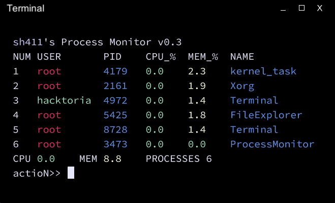

# DEPRECATION WARNING!

This project is no longer maintained. For new alternative, please proceed to https://github.com/h4cktoria/task-manager

# Process Monitor

_Your swiss army knife when it comes to process-handling_

Important note: this is __NOT A REAL PROGRAM__! This has been made, works and will work only in the game called Grey Hack!

## Objectives

Process Monitor aims to bring the functionality of Activity Manager(from Microsoft Windows) or Process Monitor(from GNU/Linux) into the Grey Hack

## Features

There are some of the features of Process Monitor:

- Htop mode: Watch for processes in real time
- Manipulation: Choose processes you want to manipulate on. Currently, you can kill processes and take snapshots of them running
- Configuration: Edit the program's configuration via configuration menu or directly via changing .conf file
- User Themes: Edit look-and-feel of the program

... and more coming soon!

## Known Bugs

- None so far, so You tell me!

## Installation Guide

- Download the sources and get them into the game
- Move __sh411Lib.src__ and __ProcessMonitor.src__ into your __/root__ folder
- Compile __ProcessMonitor.src__
- Launch compiled binary. Type __help__ to see all available commands

## License

This software is licensed under GPL v3. See [here](https://github.com/h4cktoria/process-monitor/blob/main/LICENSE) for full details

> Process Monitor - Your swiss army knife when it comes to process-handling.
> Copyright (C) 2023  Hacktoria
>
> This program is free software: you can redistribute it and/or modify
> it under the terms of the GNU General Public License as published by
> the Free Software Foundation, either version 3 of the License, or
> (at your option) any later version.
>
> This program is distributed in the hope that it will be useful,
> but WITHOUT ANY WARRANTY; without even the implied warranty of
> MERCHANTABILITY or FITNESS FOR A PARTICULAR PURPOSE.  See the
> GNU General Public License for more details.

## Thanks and Credits

- [Grey Hack](https://store.steampowered.com/app/605230/Grey_Hack/)
- [Joe Strout](https://github.com/JoeStrout) - for creating [MiniScript](https://github.com/JoeStrout/miniscript)
